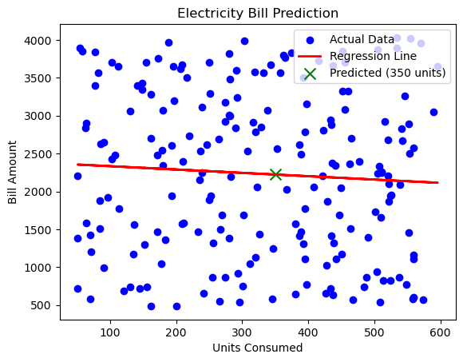

# ⚡ Electricity Bill Predictor  

This project predicts **electricity bills** based on **units consumed** using Machine Learning.  
The goal is to estimate the monthly bill amount by analyzing historical electricity consumption and applying predictive models.  

---

## 📌 Project Overview  

- Dataset: `regression_datasets_large.xlsx - Electricity_Bill.csv`  
- Goal: Predict **Electricity Bill** from **Units Consumed**.  
- Performed **Exploratory Data Analysis (EDA)** to understand consumption patterns.  
- Applied **Linear Regression** to build a predictive model.  
- Visualized the regression line and evaluated model performance.  

---

## ⚙️ Requirements  

Make sure you have the following installed:  

- Python 3.8+  
- Jupyter Notebook / JupyterLab  

Install the dependencies:  

```bash
pip install -r requirements.txt
```  

Typical packages used in this project include:  
- numpy  
- pandas  
- matplotlib  
- seaborn  
- scikit-learn  

---

## 🛠 Installation & Setup  

1. Clone this repository:  
   ```bash
   git clone https://github.com/Gokul-bit165/electricity-bill-predictor.git
   cd electricity-bill-predictor
   ```

2. Install dependencies:  
   ```bash
   pip install -r requirements.txt
   ```

3. Run the notebook:  
   ```bash
   jupyter notebook electricitybill.ipynb
   ```

---

## 📊 Outcomes  

- Identified a **clear positive relationship** between units consumed and bill amount.  
- Built a **Linear Regression model** to predict electricity bills.  
- Visualized the regression line showing how consumption affects billing.  
- Model evaluation with R² score indicates predictive power.  

---

## 🖼 Output Images  

📌 Example Linear Regression Plot:  

```markdown

```

---

## ✅ Conclusion  

- **Units consumed** is strongly correlated with electricity bill amount.  
- The model can predict approximate bill values, but additional factors (tariff rates, fixed charges, taxes, seasonal variations) may influence actual billing.  
- Predicted bill for a given consumption (example: X units) = **₹2222.401193105902 (model output)**.  
- R² score = **0.004193727521376478** → indicates how much variance in bills is explained by units consumed.  

Future improvements:  
- Include more features (peak/off-peak usage, subsidies, seasonal tariffs).  
- Try advanced models like **Polynomial Regression** or **Decision Trees** for better accuracy.  

---

## 📂 Repository Structure  

```
ELECTRICITY_BILL/
│── images/
│   └── ElectricityBill_regression_plot.png   # Output plot
│── electricitybill.ipynb                     # Main Jupyter Notebook
│── regression_datasets_large.xlsx - Electricity_Bill.csv   # Dataset
│── requirements.txt                          # Python dependencies
│── README.md                                 # Project documentation
```

---


